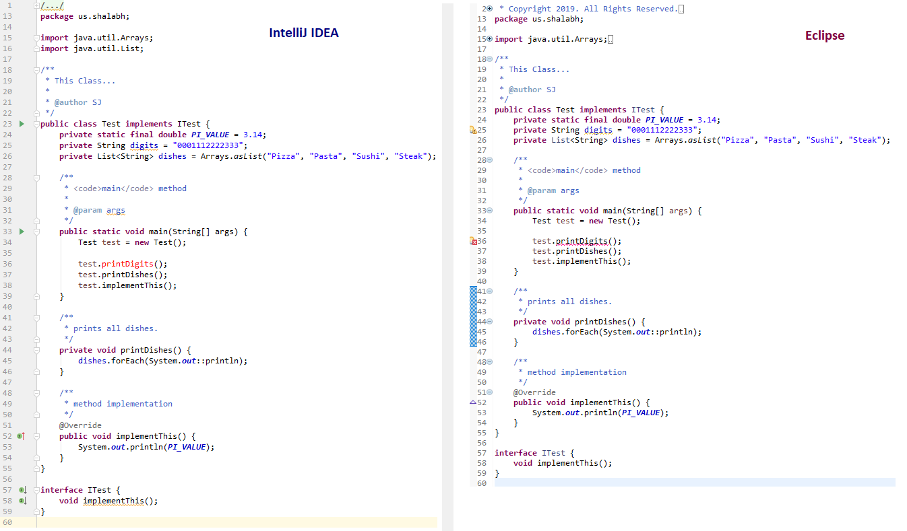
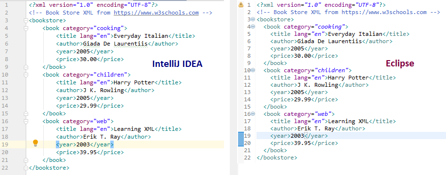

# Eclipse Like Syntax Colors for IntelliJ IDEA

## Java and XML Syntax colors

#### Steps to follow

1. **Import the `eclipse-colors.icls` file in IntelliJ**  
`File` | `Settings` | `Editor` | `Color Scheme`  
Click on `Gear Icon` | `Import Scheme as .icls` | `Import eclipse-colors.icls`

2. **Set Font, Size and Spacing**   
`File` |  `Settings` | `Editor` | `Font`  
Set `Font` to `Consolas`  
Set `Size` to `13`  
Set `Line Spacing` to `1.0` 

## IntelliJ and Ecplise Side by Side

### Java

### XML

